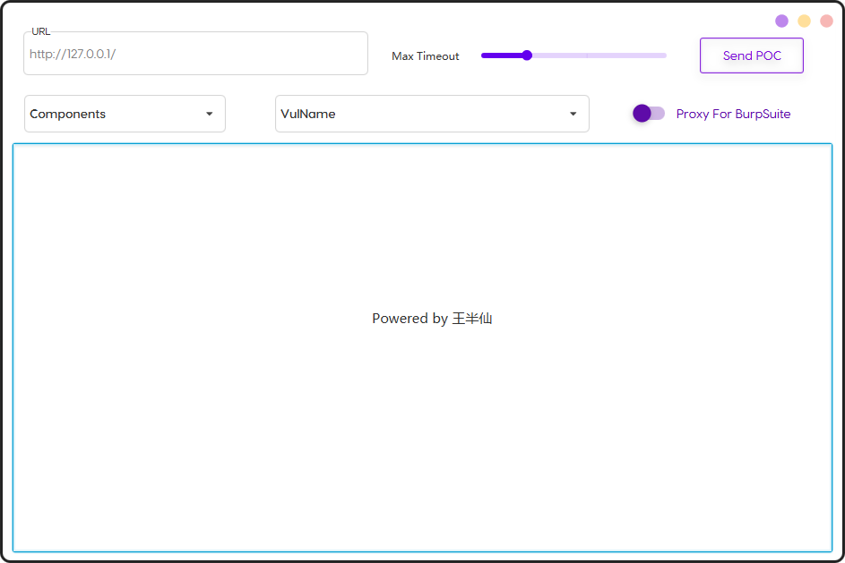
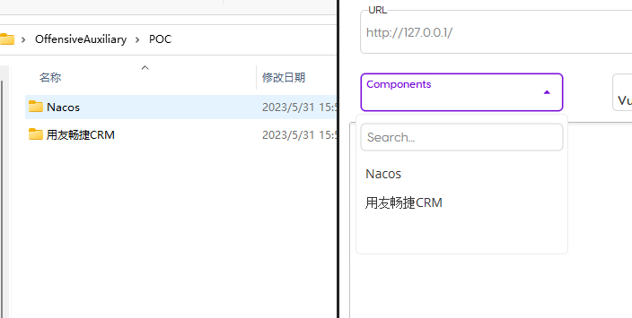
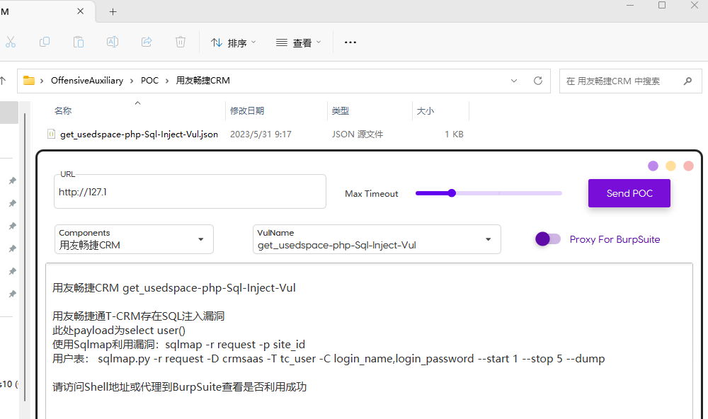

# OffensiveAuxiliary

半自动化漏洞利用工具，并非漏洞扫描工具，仅仅算是组合POC然后发包的工具。



## Components

Components => 组件

所有组件文件放置在POC文件夹下，一个组件一个文件夹。例如

```python
C:OffensiveAuxiliary\POC>tree /F


├─Nacos
│      users-UnAuth-Add-User-Vul.json
│
└─用友畅捷CRM
        get_usedspace-php-Sql-Inject-Vul.json
```



## VulName

VulName => 漏洞名称

一个漏洞一个json文件，文件随便自己认识就好

选择 "All" 会GET请求所有漏洞路径，返回200即认为漏洞存在，因为开头说了并非扫描工具，而是辅助攻击的



## Max Timeout

Max Timeout => 超时

默认为3秒，可选1-10

## Proxy For BurpSuite

Proxy For BurpSuite => 代理到BurpSuite

默认关闭，利用漏洞时打开

## 漏洞模板

Default.json

尽量只留需要使⽤的Header，把HOST等字段去掉，避免使⽤时将Cookie，HOST等信息刷掉。

```json
{
    "step": 3,
    //漏洞描述，漏洞利用成功时会输出到结果框
    "description": "\u6d4b\u8bd5\u63cf\u8ff0",
    //漏洞利⽤，LIST -> dict
	//漏洞利⽤需要⼏个请求就写⼏个dict
    "exploit": [
        {
            // 请求⽅法
            "method": "GET",
            // 漏洞路径
            "path": "/testpath/test.php",
            // 请求头 -> dict 无特殊要求不用加UA
            "header": {
                "User-Agent": "i'm come in"
            },
            // 请求体 Base64后的String
            "body": "",
            "verify": [ 
                { 
                    //状态码=200 
                    "statusCode": 200 
                }, 
                { 
                    // 响应头包含text/html 
                    "responseHead": "text/html" 
                }, 
                //响应体包含e10adc3949ba59abbe56e057f20f883e 和 success 
                { 
                    //响应体包含e10adc3949ba59abbe56e057f20f883e 
                    "responseBody": "e10adc3949ba59abbe56e057f20f883e" 
                }, 
                { 
                    //响应体包含success 
                    "responseBody": "success" 
                } 
            ]
        },
        {
            "method": "POST",
            "path": "/testpostpath/test.php",
            "header": {
                "User-Agent": "i'm come in",
                "Content-Type": "text/xml"
            },
            "body": "dGVzdFBPU1RwYXJhbXM="
        },
        {
            "method": "PUT",
            "path": "/",
            "header": {
                "User-Agent": "i'm come in"
            },
            "body": "PD9waHAgcGhwaW5mbygpOz8+"
        }
    ]
}
```
